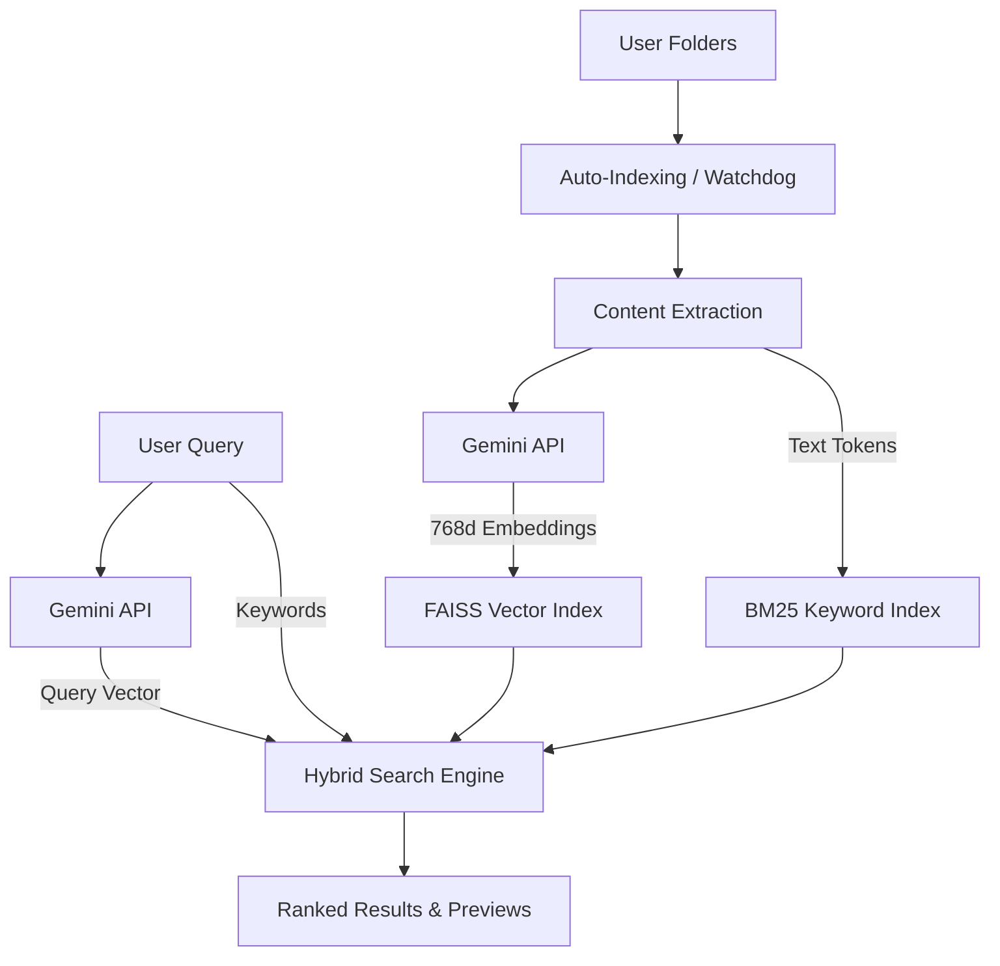

<div align="center">

# ✦ SEARCH WIZARD

### Spotlight for your computer.

Search images, videos, audio, and documents using natural language. It's not AI, it's completely AI-free — just pure math with magic.

[](https://opensource.org/licenses/MIT)
[]()
[]()

[Download](https://github.com/deepanmpc/SMART-SEARCH/releases) · [Website](https://deepanmpc.github.io/SMART-SEARCH) · [Documentation](docs/)

</div>

---

## ✨ What is Search Wizard?

Search Wizard is a **local search engine** that gives your computer a "semantic brain". It's not AI, it's completely AI-free — just pure math with magic. Instead of hunting for filenames, just type what you remember:

> *"photo of a person wearing blue coolers"*
> *"a music that sounds like a lions roar"*
> *"screenshot of a pizza recipe from last month"*
> *"voice note where I hummed a jazz tune"*

It works across **images, videos, audio, PDFs, Word docs, and code files** using the power of Google Gemini Multimodal Embeddings.

---

## 🎬 Demo


*Note: Replace with actual demo GIF once recorded.*

---

## 🚀 Key Features

- 🪄 **Semantic Search**: Search by meaning, not titles. "sunset at the beach" finds the right file even if it's named `IMG_9021.jpg`.
- 📊 **Multimodal Support**: One search for everything. Images, videos, audio, and complex documents (PDF, DOCX).
- ⚡ **Blazing Fast**: Spotlight-style launcher opening in **<150ms**.
- 👁️ **Instant Preview**: Rich preview pane with thumbnails, text snippets, and metadata.
- 🧙 **Assistant Mode**: Ask questions about your files: `ask what do my meeting notes say about our launch date?`
- 🔒 **Privacy First**: Everything runs **100% locally**. Your files never leave your machine.
- 🖱️ **Keyboard-First**: Full navigation with arrows, `Space` to preview, and `Enter` to open.

---

## 🏗️ Architecture



**Tech Stack:** Electron, FastAPI (Python), Google Gemini (Multimodal Embeddings), FAISS (Vector DB), SQLite (Metadata), BM25 (Keyword Retrieval), Watchdog (Auto-indexing).

---

## ⌨️ Keyboard shortcuts

| Shortcut | Action |
|----------|--------|
| `⌘ Shift Space` | Open / Close Launcher |
| `↑ ↓` | Navigate results |
| `Space` | Preview result |
| `Enter` | Open file |
| `⌘ R` | Reveal in Finder / Explorer |
| `Esc` | Close launcher |

---

## 🔍 Example Queries

Try these in the search bar:
- `photo of a person wearing blue coolers`
- `a music that sounds like a lions roar`
- `screenshot of a pizza recipe from last month`
- `video of me attempting a backflip`
- `voice note where I hummed a jazz tune`

---

## 🔒 Privacy & Trust

Search Wizard was built with privacy as a core principle:
- **No File Uploads**: Your actual files are never uploaded to any server.
- **Local Database**: The vector index (FAISS) and metadata (SQLite) are stored entirely on your computer.
- **API Security**: Only short text/image snippets are sent to Google Gemini to generate embeddings.

---

##  macOS Security Note

If you download the `.dmg` and see a message saying **"SEARCH WIZARD is damaged and can't be opened"**, this is a standard macOS security feature (Gatekeeper) for unsigned applications.

### 🛠️ How to fix (COMPULSORY):
1.  Open **Terminal** on your Mac.
2.  Run this command:
    ```bash
    xattr -cr /Applications/SEARCH\ WIZARD.app
    ```
3.  Open the app! It will work perfectly.

---

## 🛠️ Development

```bash
# Clone the repo
git clone https://github.com/deepanmpc/SMART-SEARCH.git
cd SMART-SEARCH

# Set up Python 3.11+ backend
python3.11 -m venv .venv
source .venv/bin/activate
pip install -r requirements.txt

# Start the backend
python src/api.py

# In another terminal, start the Electron UI
cd launcher
npm install
npm start
```

---

## 👤 Creator

**Deepan Chandrasekaran** — AI Engineer building tools for intelligent computing.

- [GitHub](https://github.com/deepanmpc)
- [LinkedIn](https://linkedin.com/in/deepanmpc)

---

## 📄 License

MIT License. Free for everyone!

---

<div align="center">

**⭐ Star this repo if you find it useful!**

*"This is like Spotlight — but Search Wizard."*

</div>
